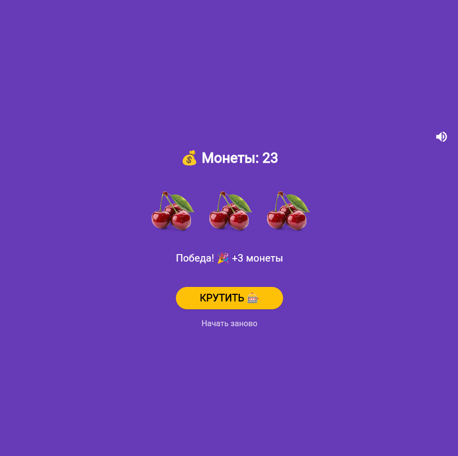

# Учебное приложение. 🎰 Слот-машина

Простое Flutter-приложение - симулятор казино. Крути барабаны, собирай одинаковые символы и выигрывай монеты!
## 📱 Скриншоты

| Главный экран | Победа | Монеты закончились |
| --- | --- | --- |
|  |  |  |

## 🎮 Как играть

- Нажмите **КРУТИТЬ**, чтобы запустить барабаны


## Инструкция по запуску

1. Убедитесь, что установлен Flutter SDK (версия 3.0 или выше)
2. Клонируйте репозиторий:
   ```bash
   git clone https://github.com/ssscvlnk/Flutter_Lab6.git
   cd Flutter_Lab6
   ```
3. Установите зависимости:
   ```bash
   flutter pub get
   ```
4. Подключите устройство или эмулятор, либо используйте Chrome:
   ```bash
   flutter run -d chrome
   ```
5. Дождитесь сборки и наслаждайтесь приложением.