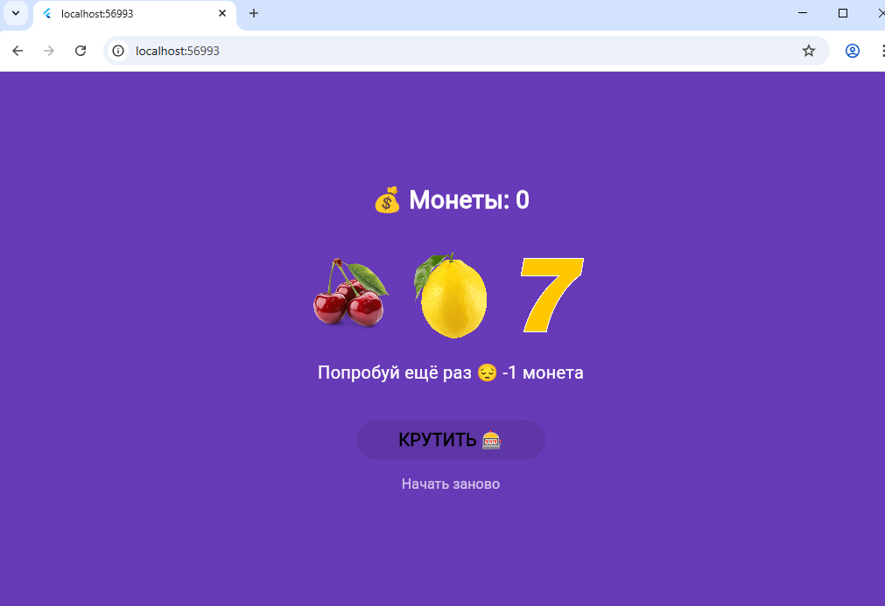

# Лабораторная работа №6. Flutter: StatefulWidget и управление состоянием

## Информация о студенте

**Фамилия, имя:** Старцева Полина

**Группа:** ИСП-231

**Дата сдачи:** 02.05.2026

## Что изучили

1. **StatefulWidget и State** — понял разницу между StatelessWidget и StatefulWidget, научился создавать виджеты с изменяемым состоянием и использовать метод `setState()` для перерисовки UI.

2. **Управление состоянием** — освоил хранение и изменение данных внутри State-объекта: счётчик монет, символы барабанов, флаги блокировки.

3. **Асинхронные операции и анимации** — реализовал реалистичную прокрутку барабанов с использованием `Future.delayed`, разными фазами скорости и поочерёдной остановкой.

4. **Анимированные виджеты** — применил `AnimatedOpacity` для мигания барабанов и `AnimatedSwitcher` для плавной смены текста сообщений.

5. **Декомпозиция виджетов** — вынес повторяющийся код (ряд барабанов) в отдельный StatelessWidget `SlotRow`, соблюдая принцип single responsibility.

6. **Работа с Git и документацией** — научился делать поэтапные коммиты и оформлять README-файл с описанием проекта.

## Скриншот приложения



## Инструкция по запуску

1. Убедитесь, что установлен Flutter SDK (версия 3.0 или выше)
2. Клонируйте репозиторий:
   ```bash
   git clone https://github.com/ssscvlnk/Flutter_Lab6.git
   cd Flutter_Lab6
   ```
3. Установите зависимости:
   ```bash
   flutter pub get
   ```
4. Подключите устройство или эмулятор, либо используйте Chrome:
   ```bash
   flutter run -d chrome
   ```
5. Дождитесь сборки и наслаждайтесь приложением.